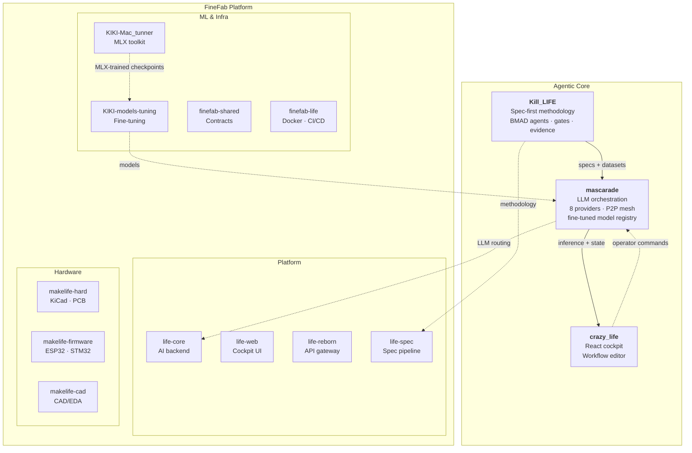

# L'Electron Rare — Org archived 2026-04-22

> **This org is now a redirect shell.** On 2026-04-22, all active FineFab, life, and makelife repositories were transferred to the personal user account **[github.com/electron-rare](https://github.com/electron-rare)** for simpler ownership during the pre-launch phase of the L'Electron Rare business entity.
>
> GitHub keeps 301 redirects from these old org URLs for 90 days. After that, update any remaining clones with `git remote set-url origin git@github.com:electron-rare/<repo>.git`.
>
> Two repositories stay here for now: [`KIKI-models-tuning`](https://github.com/L-electron-Rare/KIKI-models-tuning) and [`KIKI-Mac_tunner`](https://github.com/L-electron-Rare/KIKI-Mac_tunner) — the ML training toolkits referenced below.
>
> Historical context preserved below.

---

# L'Electron Rare

> *"The boundary between physical and non-physical is very imprecise for us."* — Donna Haraway, A Cyborg Manifesto

**Bridging embedded hardware and AI — local-first, multi-machine, no cloud lock-in.**

---

## Latest Releases — April 2026

Two public releases this week, covering the full fine-tuning pipeline:

| Date | Project | Summary |
|---|---|---|
| **17/04** | [`clemsail/micro-kiki-v3`](https://huggingface.co/clemsail/micro-kiki-v3) | Cognitive LLM stack for embedded engineering — 35 domain LoRAs on Qwen3.5-35B-A3B, router + negotiator + anti-bias + Aeon memory. Apache 2.0, GGUF, 262K context. |
| **16/04** | [`L-electron-Rare/KIKI-Mac_tunner`](https://github.com/L-electron-Rare/KIKI-Mac_tunner) | MLX fine-tuning toolkit for Mac Studio — distills Claude Opus reasoning into Mistral Large 123B. Apache 2.0. |

Training pipeline (`KIKI-Mac_tunner`) and its output model (`micro-kiki-v3`) are both open-source. Benchmarks, forks, and negative findings welcome on the [discussion thread](https://huggingface.co/clemsail/micro-kiki-v3/discussions/1).

---

## The Vision

We build monstrous systems — in Haraway's sense. Hybrid organisms where ESP32 firmware and language models share the same nervous system, where a PCB design agent and a fine-tuned LLM are parts of one body.

AI should run where the work happens: on the edge, across heterogeneous machines, orchestrated as a single organism. L'Electron Rare builds the stack that connects embedded firmware to LLM inference to real-time cockpits — without sending a single byte to someone else's cloud.

Every layer is designed to be owned, modified, and deployed by the people who use it.

---

## Architecture

Two interconnected ecosystems — the agentic core and the manufacturing platform:

---

## Key Projects

| Project | What it does |
|---------|-------------|
| [**mascarade**](https://github.com/electron-rare/mascarade) | Multi-machine agentic LLM orchestration — P2P mesh, 8 providers, RAG pipeline, fine-tuned model registry |
| [**Kill_LIFE**](https://github.com/electron-rare/Kill_LIFE) | Spec-first agentic methodology for embedded systems — BMAD agents, gates, evidence packs |
| [**le-mystere-professeur-zacus**](https://github.com/electron-rare/le-mystere-professeur-zacus) | AI-powered escape room: ESP32-S3 firmware + React game engine + real-time voice pipeline |
| [**KiC-AI**](https://github.com/electron-rare/KiC-AI) | AI-powered PCB design assistant for KiCad — chat interface, schematic review, PCB analysis, local LLM |
| [**prima-cpp**](https://github.com/electron-rare/prima-cpp) | Distributed LLM inference engine using pipelined-ring parallelism with CUDA and ZMQ |
| [**openDIAW.be**](https://github.com/electron-rare/openDIAW.be) | AI-powered music instruments for live performance — 9 instruments, real-time audio synthesis |
| [**ai-novel-engine**](https://github.com/electron-rare/ai-novel-engine) | Local-first writing atelier — AI generation via Mascarade / Mistral / OpenAI |

---

## Research

Open frontier work on cognition, self-organization, and fine-tuning — public repos, paper drafts, reproducible experiments:

| Project | What it explores |
|---------|------------------|
| [**micro-kiki**](https://github.com/electron-rare/micro-kiki) | 32 domain experts (MoE-LoRA) on Qwen3.5-4B base — fits RTX 4090 24GB. Distilled from Mistral-Large-Opus / Qwen3.5-122B teachers |
| [**dream-of-kiki**](https://github.com/electron-rare/dream-of-kiki) | Substrate-agnostic formal framework for dream-based knowledge consolidation in artificial cognitive systems (paper v0.4) |
| [**kiki-flow-research**](https://github.com/electron-rare/kiki-flow-research) | Wasserstein-gradient-flow engine for micro-kiki self-organization |
| [**KIKI-Mac_tunner**](https://github.com/L-electron-Rare/KIKI-Mac_tunner) | MLX fine-tuning toolkit for Mac Studio M4 Pro / M3 Ultra — distill Claude Opus reasoning into Mistral Large 123B |

---

## FineFab Platform

**FineFab** (originally *Factory 4 Life*) — our AI-native manufacturing and electronics platform, decomposed into focused modules. The repo naming reflects the project's evolution:

- **`life-*`** — core platform services (the "Life" in Factory 4 Life)
- **`makelife-*`** — hardware, firmware, and CAD layers (the "Make" in MakeLife)
- **`finefab-*`** — shared infrastructure and integration (the unified FineFab identity)
- **`KIKI-*`** — ML / fine-tuning pipeline (internal codename)

| Module | Layer | Role |
|--------|-------|------|
| [**life-core**](https://github.com/electron-rare/life-core) | Platform | AI backend — LLM router, RAG, caching, orchestration |
| [**life-web**](https://github.com/electron-rare/life-web) | Platform | Operator cockpit — Vite + React 19, real-time monitoring |
| [**life-reborn**](https://github.com/electron-rare/life-reborn) | Platform | API gateway — Hono, auth, rate limiting, OpenAPI |
| [**life-spec**](https://github.com/electron-rare/life-spec) | Platform | Spec-first pipeline — specifications, BMAD gates, evidence |
| [**makelife-hard**](https://github.com/electron-rare/makelife-hard) | Hardware | KiCad projects, PCB exports, MCP servers |
| [**makelife-firmware**](https://github.com/electron-rare/makelife-firmware) | Hardware | ESP32/STM32 firmware, PlatformIO, Unity tests |
| [**makelife-cad**](https://github.com/electron-rare/makelife-cad) | Hardware | CAD/EDA platform — FastAPI + Next.js 15, AI-assisted design |
| [**KIKI-models-tuning**](https://github.com/L-electron-Rare/KIKI-models-tuning) | ML | Fine-tuning pipeline — model training, evaluation, registry |
| [**KIKI-Mac_tunner**](https://github.com/L-electron-Rare/KIKI-Mac_tunner) | ML | MLX fine-tuning toolkit for Apple Silicon (M3 Ultra / M4 Pro) |
| [**finefab-shared**](https://github.com/electron-rare/finefab-shared) | Infra | Shared contracts — JSON Schema, Pydantic, TypeScript types |
| [**finefab-life**](https://github.com/electron-rare/finefab-life) | Infra | Integration runtime — Docker Compose, CI/CD, ops cockpit |

---

## factory-4-life — the consolidated monorepo

All the FineFab subprojects listed above are assembled inside a single monorepo,
[**factory-4-life**](https://github.com/electron-rare/factory-4-life), with 21
git submodules pinned to known-good SHAs. One clone, one `docker compose`, one
CI-green check across the stack:

| Layer | Submodules |
|-------|------------|
| Backend | `life-core`, `life-reborn`, `life-web`, `finefab-shared` |
| Hardware | `makelife-cad`, `makelife-firmware`, `makelife-hard` |
| RAG + Web | `rag-web`, `nc-rag-indexer`, `e2e-tests` |
| Runtime | `finefab-life` (self-contained `docker-compose.prod.yml`) |
| Meta | `life-spec`, `life-project`, `agent-factory-cockpit` |

**Phase 7 in progress** — Industrialisation et Intégration Complète: hardened
traefik + Keycloak OIDC across every service, shared forward-auth cookie on
`.saillant.cc`, nightly RAG indexer, Grafana + Jaeger + Langfuse dashboards
wired end-to-end. See the monorepo `CLAUDE.md` for the full map of 24 nested
CLAUDE.md files and per-domain runbooks.

---

**Factory 4 Life monorepo** | **21 submodules** | **Keycloak SSO** | **Traefik + Cloudflare** | **MLX + CUDA fine-tuning** | **Local-first, no cloud lock-in**

---

*"Monsters have always defined the limits of community in Western imaginations."* — Donna Haraway

[lelectronrare.fr](https://lelectronrare.fr) | [contact@lelectronrare.fr](mailto:contact@lelectronrare.fr)
