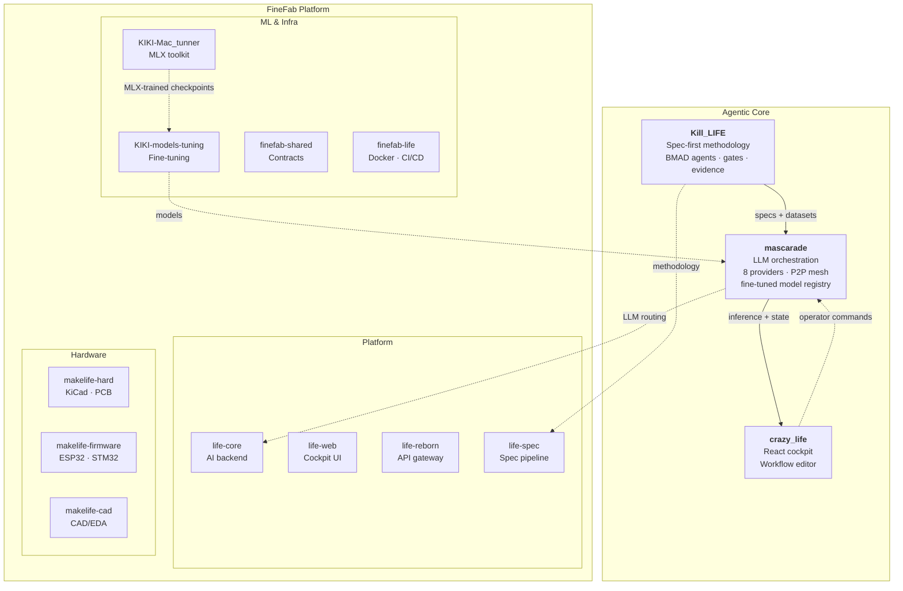
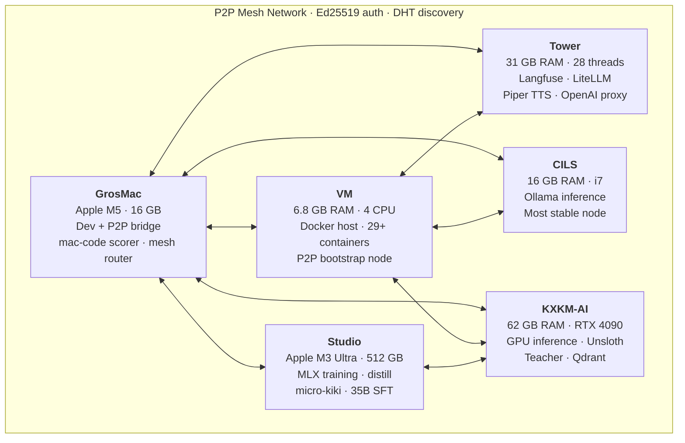

# L'Electron Rare

> *"The boundary between physical and non-physical is very imprecise for us."* — Donna Haraway, A Cyborg Manifesto

**Bridging embedded hardware and AI — local-first, multi-machine, no cloud lock-in.**

---

## The Vision

We build monstrous systems — in Haraway's sense. Hybrid organisms where ESP32 firmware and language models share the same nervous system, where a PCB design agent and a fine-tuned LLM are parts of one body.

AI should run where the work happens: on the edge, across heterogeneous machines, orchestrated as a single organism. L'Electron Rare builds the stack that connects embedded firmware to LLM inference to real-time cockpits — without sending a single byte to someone else's cloud.

Every layer is designed to be owned, modified, and deployed by the people who use it.

---

## Architecture

Two interconnected ecosystems — the agentic core and the manufacturing platform:

---

## Key Projects

| Project | What it does |
|---------|-------------|
| [**mascarade**](https://github.com/electron-rare/mascarade) | Multi-machine agentic LLM orchestration — P2P mesh, 8 providers, RAG pipeline, fine-tuned model registry |
| [**Kill_LIFE**](https://github.com/electron-rare/Kill_LIFE) | Spec-first agentic methodology for embedded systems — BMAD agents, gates, evidence packs |
| [**le-mystere-professeur-zacus**](https://github.com/electron-rare/le-mystere-professeur-zacus) | AI-powered escape room: ESP32-S3 firmware + React game engine + real-time voice pipeline |
| [**KiC-AI**](https://github.com/electron-rare/KiC-AI) | AI-powered PCB design assistant for KiCad — chat interface, schematic review, PCB analysis, local LLM |
| [**prima-cpp**](https://github.com/electron-rare/prima-cpp) | Distributed LLM inference engine using pipelined-ring parallelism with CUDA and ZMQ |
| [**openDIAW.be**](https://github.com/electron-rare/openDIAW.be) | AI-powered music instruments for live performance — 9 instruments, real-time audio synthesis |
| [**ai-novel-engine**](https://github.com/electron-rare/ai-novel-engine) | Local-first writing atelier — AI generation via Mascarade / Mistral / OpenAI |

---

## Research

Open frontier work on cognition, self-organization, and fine-tuning — public repos, paper drafts, reproducible experiments:

| Project | What it explores |
|---------|------------------|
| [**micro-kiki**](https://github.com/electron-rare/micro-kiki) | 32 domain experts (MoE-LoRA) on Qwen3.5-4B base — fits RTX 4090 24GB. Distilled from Mistral-Large-Opus / Qwen3.5-122B teachers |
| [**dream-of-kiki**](https://github.com/electron-rare/dream-of-kiki) | Substrate-agnostic formal framework for dream-based knowledge consolidation in artificial cognitive systems (paper v0.4) |
| [**kiki-flow-research**](https://github.com/electron-rare/kiki-flow-research) | Wasserstein-gradient-flow engine for micro-kiki self-organization |
| [**KIKI-Mac_tunner**](https://github.com/L-electron-Rare/KIKI-Mac_tunner) | MLX fine-tuning toolkit for Mac Studio M4 Pro / M3 Ultra — distill Claude Opus reasoning into Mistral Large 123B |

---

## FineFab Platform

**FineFab** (originally *Factory 4 Life*) — our AI-native manufacturing and electronics platform, decomposed into focused modules. The repo naming reflects the project's evolution:

- **`life-*`** — core platform services (the "Life" in Factory 4 Life)
- **`makelife-*`** — hardware, firmware, and CAD layers (the "Make" in MakeLife)
- **`finefab-*`** — shared infrastructure and integration (the unified FineFab identity)
- **`KIKI-*`** — ML / fine-tuning pipeline (internal codename)

| Module | Layer | Role |
|--------|-------|------|
| [**life-core**](https://github.com/L-electron-Rare/life-core) | Platform | AI backend — LLM router, RAG, caching, orchestration |
| [**life-web**](https://github.com/L-electron-Rare/life-web) | Platform | Operator cockpit — Vite + React 19, real-time monitoring |
| [**life-reborn**](https://github.com/L-electron-Rare/life-reborn) | Platform | API gateway — Hono, auth, rate limiting, OpenAPI |
| [**life-spec**](https://github.com/L-electron-Rare/life-spec) | Platform | Spec-first pipeline — specifications, BMAD gates, evidence |
| [**makelife-hard**](https://github.com/L-electron-Rare/makelife-hard) | Hardware | KiCad projects, PCB exports, MCP servers |
| [**makelife-firmware**](https://github.com/L-electron-Rare/makelife-firmware) | Hardware | ESP32/STM32 firmware, PlatformIO, Unity tests |
| [**makelife-cad**](https://github.com/L-electron-Rare/makelife-cad) | Hardware | CAD/EDA platform — FastAPI + Next.js 15, AI-assisted design |
| [**KIKI-models-tuning**](https://github.com/L-electron-Rare/KIKI-models-tuning) | ML | Fine-tuning pipeline — model training, evaluation, registry |
| [**KIKI-Mac_tunner**](https://github.com/L-electron-Rare/KIKI-Mac_tunner) | ML | MLX fine-tuning toolkit for Apple Silicon (M3 Ultra / M4 Pro) |
| [**finefab-shared**](https://github.com/L-electron-Rare/finefab-shared) | Infra | Shared contracts — JSON Schema, Pydantic, TypeScript types |
| [**finefab-life**](https://github.com/L-electron-Rare/finefab-life) | Infra | Integration runtime — Docker Compose, CI/CD, ops cockpit |

---

## Infrastructure

Heterogeneous machines, one P2P mesh — a distributed body across CUDA, Apple Silicon, and commodity x86:

---

**2000+ commits** | **8 LLM providers** | **6-node P2P mesh** | **32 MoE domain experts** | **MLX + CUDA training** | **500K+ dataset examples**

---

*"Monsters have always defined the limits of community in Western imaginations."* — Donna Haraway

[lelectronrare.fr](https://lelectronrare.fr) | [contact@lelectronrare.fr](mailto:contact@lelectronrare.fr)
