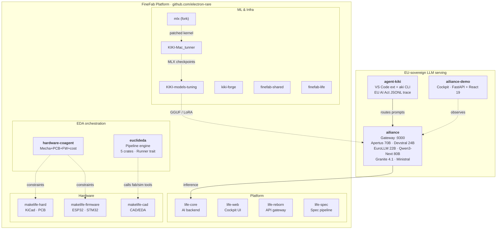

# L'Electron Rare — Org partially archived 2026-04-22

> **Status (updated 2026-05-11).** On 2026-04-22, the historical FineFab,
> life-*, and makelife-* repositories were transferred to the personal user
> account **[github.com/electron-rare](https://github.com/electron-rare)** for
> simpler ownership during the pre-launch phase of the L'Electron Rare business
> entity. GitHub keeps 301 redirects from the old org URLs for 90 days (until
> ~2026-07-22). After that, update any remaining clones with
> `git remote set-url origin git@github.com:electron-rare/<repo>.git`.
>
> **However**, this org is **not** a pure redirect shell anymore: since the
> archive, several new repositories have been created here and are actively
> developed. They are listed below.
>
> Historical context preserved further down.

---

## Active in this org (post-archive)

These are the repositories developed inside `L-electron-Rare` *after* the
2026-04-22 transfer — the EU-sovereign LLM serving stack, the autonomous
coding agent, the EDA pipeline engine, and the multi-domain hardware
co-design framework:

| Repo | Vis. | Role |
|------|------|------|
| [`ailiance`](https://github.com/L-electron-Rare/ailiance) | private | EU-sovereign multi-model LLM gateway — Apertus 70B + Devstral 24B + EuroLLM 22B + Qwen3-Next 80B + Granite 4.1 + Ministral, EU AI Act Art. 52/53 transparency, JSONL audit trace |
| [`ailiance-demo`](https://github.com/L-electron-Rare/ailiance-demo) | public | Frontend cockpit for the LLM fleet — public showcase + Tailscale-only admin (FastAPI + Vite + React 19) |
| [`agent-kiki`](https://github.com/L-electron-Rare/agent-kiki) | public | EU-sovereign autonomous coding agent — VS Code extension + Ink CLI (`aki`). Fork of Dirac/Cline, routed by default to the `eu-kiki` LLM gateway, with EU AI Act-compliant JSONL tracing |
| [`euclideda`](https://github.com/L-electron-Rare/euclideda) | private | Open-source pipeline orchestration engine for sovereign EU EDA workflows. Phase 0+1+2+3 closed (5 crates, Runner trait, 61+ tests) |
| [`hardware-coagent`](https://github.com/L-electron-Rare/hardware-coagent) | private | Multi-agent hardware co-design — shared parametric constraints across mecha, PCB, firmware, cost |
| [`mlx`](https://github.com/L-electron-Rare/mlx) | public | Fork of Apple's MLX — `metal-Nx-buffer-limit` branches (resource-limit handles + cache-limit bytes patches for large-model training on M3 Ultra) |
| [`KIKI-Mac_tunner`](https://github.com/L-electron-Rare/KIKI-Mac_tunner) | public | MLX fine-tuning toolkit for Mac Studio M3 Ultra 512 GB — distills Claude Opus reasoning into Mistral Large 123B |
| [`KIKI-models-tuning`](https://github.com/L-electron-Rare/KIKI-models-tuning) | public | FineFab fine-tuning pipeline — model training, evaluation, registry (Unsloth, LoRA) |
| [`kiki-forge`](https://github.com/L-electron-Rare/kiki-forge) | private | Multi-compute LLM training pipeline for Mac Studio M3 Ultra (post-pivot toward `llama.cpp` + Qwen3.5 scorer) |
| [`agent-kiki-py-archive`](https://github.com/L-electron-Rare/agent-kiki-py-archive) | private | **Archived** — superseded by the TypeScript `agent-kiki` |
| [`moodle`](https://github.com/L-electron-Rare/moodle) | public | Fork of Moodle |

---

# L'Electron Rare

> *"The boundary between physical and non-physical is very imprecise for us."* — Donna Haraway, A Cyborg Manifesto

**Bridging embedded hardware and AI — local-first, multi-machine, no cloud lock-in.**

---

## Latest Releases — April 2026

| Date | Project | Summary |
|---|---|---|
| **17/04** | [`clemsail/micro-kiki-v3`](https://huggingface.co/clemsail/micro-kiki-v3) | Cognitive LLM stack for embedded engineering — 35 domain LoRAs on Qwen3.5-35B-A3B, router + negotiator + anti-bias + Aeon memory. Apache 2.0, GGUF, 262K context. |
| **16/04** | [`L-electron-Rare/KIKI-Mac_tunner`](https://github.com/L-electron-Rare/KIKI-Mac_tunner) | MLX fine-tuning toolkit for Mac Studio — distills Claude Opus reasoning into Mistral Large 123B. Apache 2.0. |

Training pipeline (`KIKI-Mac_tunner`) and its output model (`micro-kiki-v3`) are both open-source. Benchmarks, forks, and negative findings welcome on the [discussion thread](https://huggingface.co/clemsail/micro-kiki-v3/discussions/1).

---

## The Vision

We build monstrous systems — in Haraway's sense. Hybrid organisms where ESP32 firmware and language models share the same nervous system, where a PCB design agent and a fine-tuned LLM are parts of one body.

AI should run where the work happens: on the edge, across heterogeneous machines, orchestrated as a single organism. L'Electron Rare builds the stack that connects embedded firmware to LLM inference to real-time cockpits — without sending a single byte to someone else's cloud.

Every layer is designed to be owned, modified, and deployed by the people who use it.

---

## Current Architecture (2026-05)

The system is now organised around three live layers — **EU-sovereign LLM
serving**, the **FineFab manufacturing platform**, and the **autonomous coding
agent** — all wired to the same fleet of edge nodes:

The previous *Agentic Core* (mascarade / Kill_LIFE / crazy_life) is now
archived and has been superseded by the FineFab monorepo and the
ailiance + agent-kiki + euclideda stack — see
[`project_mascarade_deprecated`](https://github.com/electron-rare) for the
migration notes.

---

## Key Projects (active)

| Project | What it does |
|---------|-------------|
| [**ailiance**](https://github.com/L-electron-Rare/ailiance) | EU-sovereign LLM gateway — multi-model serving (Apertus/Devstral/EuroLLM/Qwen3-Next/Granite/Ministral), JSONL audit trace, alias rewrites, Tailscale-only admin |
| [**agent-kiki**](https://github.com/L-electron-Rare/agent-kiki) | Autonomous coding agent (VS Code + `aki` CLI), Cline fork routed to `eu-kiki` |
| [**euclideda**](https://github.com/L-electron-Rare/euclideda) | EU-sovereign EDA pipeline engine — Rust, 5 crates, dispatch over process/http/MCP |
| [**hardware-coagent**](https://github.com/L-electron-Rare/hardware-coagent) | Multi-agent hardware co-design with shared parametric constraints |
| [**factory-4-life**](https://github.com/electron-rare/factory-4-life) | Consolidated FineFab monorepo — 21 submodules pinned, single `docker compose` |
| [**le-mystere-professeur-zacus**](https://github.com/electron-rare/le-mystere-professeur-zacus) | AI-powered escape room: ESP32-S3 firmware + React game engine + real-time voice |
| [**KiC-AI**](https://github.com/electron-rare/KiC-AI) | AI-powered PCB design assistant for KiCad — local LLM, schematic review, PCB analysis |
| [**prima-cpp**](https://github.com/electron-rare/prima-cpp) | Distributed LLM inference engine, pipelined-ring parallelism (CUDA + ZMQ) |
| [**openDIAW.be**](https://github.com/electron-rare/openDIAW.be) | AI-powered instruments for live performance — 9 instruments, real-time synthesis |
| [**ai-novel-engine**](https://github.com/electron-rare/ai-novel-engine) | Local-first writing atelier — AI generation via Mascarade / Mistral / OpenAI |

---

## Research — Hypneum Lab

Open frontier work on cognition, self-organization, and fine-tuning lives in
the sister org [**hypneum-lab**](https://github.com/hypneum-lab) (since
2026-04-20 brand pivot — "GENIAL" stays as the framework acronym used in
papers, but the lab is now Hypneum Lab):

| Project | What it explores |
|---------|------------------|
| [**dream-of-kiki**](https://github.com/hypneum-lab/dream-of-kiki) | Substrate-agnostic formal framework for dream-based knowledge consolidation (Paper 1) |
| [**nerve-wml**](https://github.com/hypneum-lab/nerve-wml) | Plasticity / GammaTheta multiplexer reference implementation (PyPI v1.8.x) |
| [**bouba_sens**](https://github.com/hypneum-lab/bouba_sens) | Benchmarks for sensorial cross-modal binding (TMLR submission track) |
| [**kiki-flow-research**](https://github.com/hypneum-lab/kiki-flow-research) | Wasserstein-gradient-flow engine for micro-kiki self-organization |
| [**micro-kiki**](https://github.com/hypneum-lab/micro-kiki) | 32 domain experts (MoE-LoRA) on Qwen3.5-4B base — fits RTX 4090 24GB |
| [**iact-bench**](https://github.com/hypneum-lab/iact-bench) | EU AI Act audit-grade benchmark — 31 domains × ≤23 models, 23 sandboxed Docker validators |

---

## FineFab Platform — repo map

The FineFab platform now lives entirely under
[`github.com/electron-rare`](https://github.com/electron-rare). The naming
reflects the project's evolution:

- **`life-*`** — core platform services (the "Life" in Factory 4 Life)
- **`makelife-*`** — hardware, firmware, and CAD layers (the "Make" in MakeLife)
- **`finefab-*`** — shared infrastructure and integration (the unified FineFab identity)
- **`KIKI-*`** — ML / fine-tuning pipeline (kept in this org)

| Module | Layer | Role |
|--------|-------|------|
| [**life-core**](https://github.com/electron-rare/life-core) | Platform | AI backend — LLM router, RAG, caching, orchestration |
| [**life-web**](https://github.com/electron-rare/life-web) | Platform | Operator cockpit — Vite + React 19, real-time monitoring |
| [**life-reborn**](https://github.com/electron-rare/life-reborn) | Platform | API gateway — Hono, auth, rate limiting, OpenAPI |
| [**life-spec**](https://github.com/electron-rare/life-spec) | Platform | Spec-first pipeline — specifications, BMAD gates, evidence |
| [**makelife-hard**](https://github.com/electron-rare/makelife-hard) | Hardware | KiCad projects, PCB exports, MCP servers |
| [**makelife-firmware**](https://github.com/electron-rare/makelife-firmware) | Hardware | ESP32/STM32 firmware, PlatformIO, Unity tests |
| [**makelife-cad**](https://github.com/electron-rare/makelife-cad) | Hardware | CAD/EDA platform — FastAPI + Next.js 15, AI-assisted design |
| [**KIKI-models-tuning**](https://github.com/L-electron-Rare/KIKI-models-tuning) | ML | Fine-tuning pipeline — model training, evaluation, registry |
| [**KIKI-Mac_tunner**](https://github.com/L-electron-Rare/KIKI-Mac_tunner) | ML | MLX fine-tuning toolkit for Apple Silicon |
| [**finefab-shared**](https://github.com/electron-rare/finefab-shared) | Infra | Shared contracts — JSON Schema, Pydantic, TypeScript types |
| [**finefab-life**](https://github.com/electron-rare/finefab-life) | Infra | Integration runtime — Docker Compose, CI/CD, ops cockpit |

---

## factory-4-life — the consolidated monorepo

All FineFab subprojects above are assembled inside a single monorepo,
[**factory-4-life**](https://github.com/electron-rare/factory-4-life), with 21
git submodules pinned to known-good SHAs. One clone, one `docker compose`, one
CI-green check across the stack:

| Layer | Submodules |
|-------|------------|
| Backend | `life-core`, `life-reborn`, `life-web`, `finefab-shared` |
| Hardware | `makelife-cad`, `makelife-firmware`, `makelife-hard` |
| RAG + Web | `rag-web`, `nc-rag-indexer`, `e2e-tests` |
| Runtime | `finefab-life` (self-contained `docker-compose.prod.yml`) |
| Meta | `life-spec`, `life-project`, `agent-factory-cockpit` |

**Phase 7 in progress** — Industrialisation et Intégration Complète: hardened
Traefik + Keycloak OIDC across every service, shared forward-auth cookie on
`.saillant.cc`, nightly RAG indexer, Grafana + Jaeger + Langfuse dashboards
wired end-to-end. See the monorepo `CLAUDE.md` for the full map of 24 nested
`CLAUDE.md` files and per-domain runbooks.

---

**Factory 4 Life monorepo** | **21 submodules** | **Keycloak SSO** | **Traefik + Cloudflare** | **MLX + CUDA fine-tuning** | **EU-sovereign LLM serving** | **Local-first, no cloud lock-in**

---

*"Monsters have always defined the limits of community in Western imaginations."* — Donna Haraway

[lelectronrare.fr](https://lelectronrare.fr) | [contact@lelectronrare.fr](mailto:contact@lelectronrare.fr)
