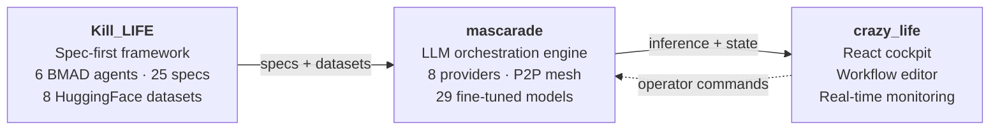
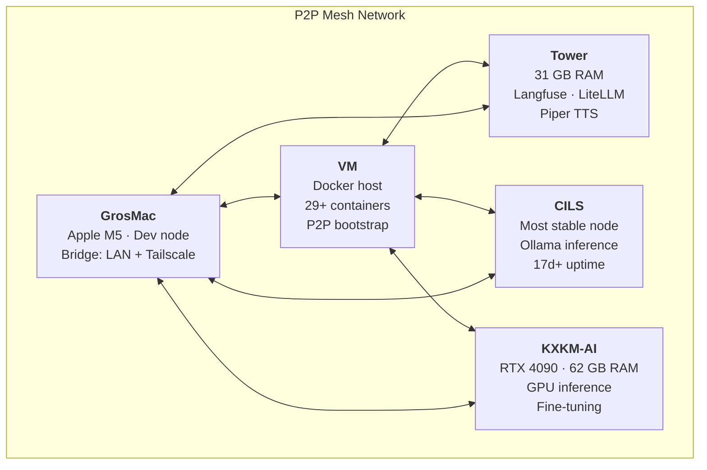

# L'Electron Rare

> *"The boundary between physical and non-physical is very imprecise for us."* — Donna Haraway, A Cyborg Manifesto

**Bridging embedded hardware and AI — local-first, multi-machine, no cloud lock-in.**

---

## The Vision

We build monstrous systems — in Haraway's sense. Hybrid organisms where ESP32 firmware and language models share the same nervous system, where a PCB design agent and a fine-tuned LLM are parts of one body.

AI should run where the work happens: on the edge, across heterogeneous machines, orchestrated as a single organism. L'Electron Rare builds the stack that connects embedded firmware to LLM inference to real-time cockpits — without sending a single byte to someone else's cloud.

Every layer is designed to be owned, modified, and deployed by the people who use it.

---

## Architecture

---

## Key Projects

| Project | What it does |
|---------|-------------|
| [**mascarade**](https://github.com/electron-rare/mascarade) | Multi-machine agentic LLM orchestration — P2P mesh, 8 providers, RAG pipeline, 29 fine-tuned models |
| [**Kill_LIFE**](https://github.com/electron-rare/Kill_LIFE) | Spec-first agentic methodology for embedded systems — BMAD agents, gates, evidence packs |
| [**le-mystere-professeur-zacus**](https://github.com/electron-rare/le-mystere-professeur-zacus) | AI-powered escape room: ESP32-S3 firmware + React game engine + real-time voice pipeline |
| [**KiC-AI**](https://github.com/electron-rare/KiC-AI) | AI-powered PCB design assistant for KiCad — schematic review, component selection, DRC analysis |
| [**prima-cpp**](https://github.com/electron-rare/prima-cpp) | Distributed LLM inference engine using pipelined-ring parallelism with CUDA and ZMQ |
| [**openDIAW.be**](https://github.com/electron-rare/openDIAW.be) | AI-powered music instruments for live performance — 9 instruments, real-time audio synthesis |

---

## FineFab Platform

The org hosts **FineFab** — our AI-native manufacturing and electronics platform, decomposed into focused modules:

| Module | Role |
|--------|------|
| [**life-core**](https://github.com/L-electron-Rare/life-core) | AI backend engine — LLM router, RAG, caching, orchestration |
| [**life-web**](https://github.com/L-electron-Rare/life-web) | Operator cockpit — Vite + React 19, real-time monitoring |
| [**life-reborn**](https://github.com/L-electron-Rare/life-reborn) | API gateway — Hono, auth, rate limiting, OpenAPI |
| [**life-spec**](https://github.com/L-electron-Rare/life-spec) | Spec-first pipeline — specifications, BMAD gates, compliance evidence |
| [**finefab-shared**](https://github.com/L-electron-Rare/finefab-shared) | Shared contracts — JSON Schema, Pydantic, TypeScript types |
| [**KIKI-models-tuning**](https://github.com/L-electron-Rare/KIKI-models-tuning) | Fine-tuning pipeline — model training, evaluation, registry |
| [**makelife-hard**](https://github.com/L-electron-Rare/makelife-hard) | Hardware design — KiCad projects, PCB exports, MCP servers |
| [**makelife-firmware**](https://github.com/L-electron-Rare/makelife-firmware) | Embedded firmware — ESP32/STM32, PlatformIO, Unity tests |
| [**makelife-cad**](https://github.com/L-electron-Rare/makelife-cad) | CAD/EDA platform — FastAPI + Next.js 15, AI-assisted design |
| [**finefab-life**](https://github.com/L-electron-Rare/finefab-life) | Integration runtime — Docker Compose, CI/CD, ops cockpit |

---

## Infrastructure

Five heterogeneous machines, one P2P mesh — a distributed body:

---

**2000+ commits** | **8 LLM providers** | **5-node P2P mesh** | **29 fine-tuned models** | **498K dataset examples**

---

*"Monsters have always defined the limits of community in Western imaginations."* — Donna Haraway

[lelectronrare.fr](https://lelectronrare.fr) | [contact@lelectronrare.fr](mailto:contact@lelectronrare.fr)
